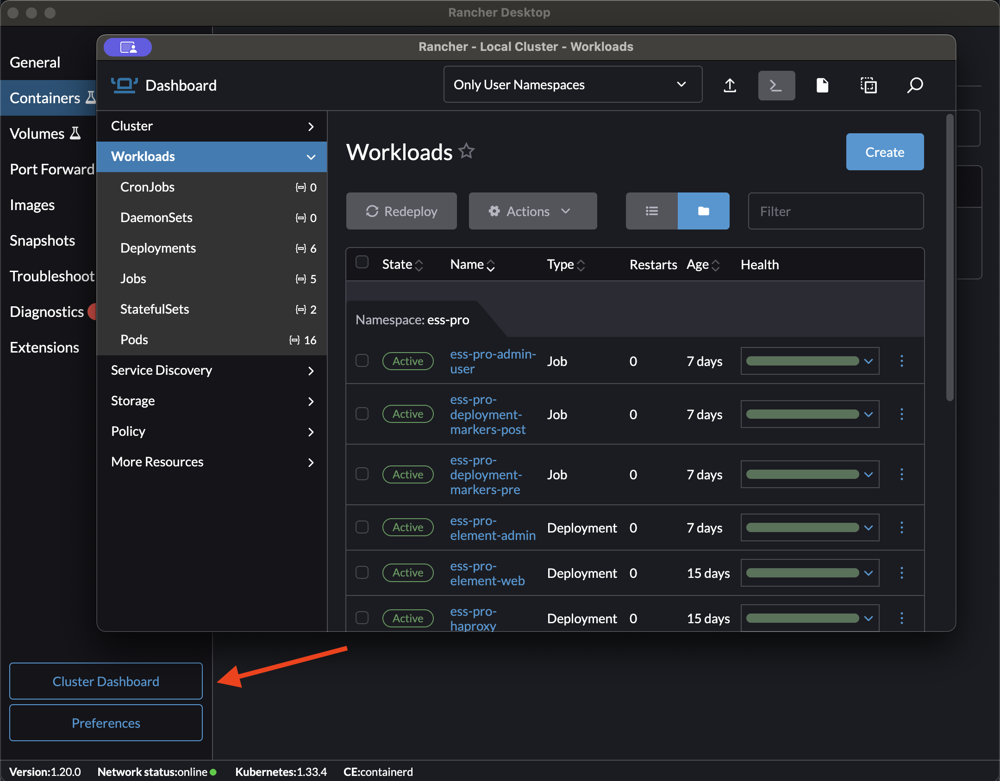

# ess-matrix-conf-2025

## Single Node Kubernetes Clusters

### Linux

- [kind](https://kind.sigs.k8s.io/docs/user/quick-start/) : A good starting point for a single node cluster on a local laptop
- [k3s](https://k3s.io/) : A good starting point for a single node cluster on a virtual machine

You can also install [k9s](https://k9scli.io/) to view and manage your cluster with a TUI.

### MacOS

- [rancher](https://rancher-desktop.io/) : A good starting point for a single node cluster with a GUI. Uses k3s under the hood.

### Windows

- [rancher](https://rancher-desktop.io/) : A good starting point for a single node cluster with a GUI. Uses k3s under the hood.

## kubectl (Kubernetes Command Line Interface)

- Go to the [kubernetes.io](https://kubernetes.io/docs/tasks/tools/) page to download and install kubectl

- With rancher, use `kubectl config use-context rancher-desktop` to switch to the rancher context.
- With kind, use `kubectl config use-context kind-<cluster name>` to switch to the kind context.

## Helm

- Go to the [helm.sh](https://helm.sh/docs/intro/install/) page to download and install helm

## Set-up

### Local laptops

#### Linux

Linux users can use the script from ESS Community repo [`scripts/setup_dev_cluster.sh`](https://github.com/element-hq/ess-helm/blob/main/scripts/setup_test_cluster.sh) to set up a local cluster with a local CA.

#### MacOS & Windows

MacOS users should use [rancher](#macos) and [mkcert](#mkcert) to set up the local CA.

#### Setup

Follow the [ESS Community README](https://github.com/element-hq/ess-helm).

For local testing:
 - For the DNS, use any `*.localhost` domain. They will automatically point to your local machine.
 - For the certificates, "Use existing certificates" option with mkcert. See below for a script simplifying the setup for the workshop.

##### Certificates

Initialize the namespace with `kubectl create namespace ess`.

###### mkcert

Useful to set up ESS on a local machine. See the [github project](https://github.com/FiloSottile/mkcert)

The workshop repository contains a script to set up local certificates on your local machine.

Example usage:

```bash
$ ./build-certs.sh demo-values/hostnames.yaml demo-values
Enter the base domain name for the certificates : ess-matrix-2025.localhost

Created a new certificate valid for the following names 📜
 - "ess-matrix-2025.localhost"

The certificate is at "./ess-matrix-2025.localhost.pem" and the key at "./ess-matrix-2025.localhost-key.pem" ✅

It will expire on 14 January 2028 🗓

secret/ess-well-known-certificate created

Created a new certificate valid for the following names 📜
 - "matrix.ess-matrix-2025.localhost"

The certificate is at "./matrix.ess-matrix-2025.localhost.pem" and the key at "./matrix.ess-matrix-2025.localhost-key.pem" ✅

It will expire on 14 January 2028 🗓

secret/ess-matrix-certificate created

Created a new certificate valid for the following names 📜
 - "mrtc.ess-matrix-2025.localhost"

The certificate is at "./mrtc.ess-matrix-2025.localhost.pem" and the key at "./mrtc.ess-matrix-2025.localhost-key.pem" ✅

It will expire on 14 January 2028 🗓

secret/ess-mrtc-certificate created

Created a new certificate valid for the following names 📜
 - "chat.ess-matrix-2025.localhost"

The certificate is at "./chat.ess-matrix-2025.localhost.pem" and the key at "./chat.ess-matrix-2025.localhost-key.pem" ✅

It will expire on 14 January 2028 🗓

secret/ess-chat-certificate created

Created a new certificate valid for the following names 📜
 - "auth.ess-matrix-2025.localhost"

The certificate is at "./auth.ess-matrix-2025.localhost.pem" and the key at "./auth.ess-matrix-2025.localhost-key.pem" ✅

It will expire on 14 January 2028 🗓

secret/ess-auth-certificate created

Created a new certificate valid for the following names 📜
 - "admin.ess-matrix-2025.localhost"

The certificate is at "./admin.ess-matrix-2025.localhost.pem" and the key at "./admin.ess-matrix-2025.localhost-key.pem" ✅

It will expire on 14 January 2028 🗓

secret/ess-admin-certificate created
```

##### Matrix RTC local setup

The following values should be used to test matrix RTC locally.

```yml
matrixRTC:
  extraEnv:
  - name: LIVEKIT_INSECURE_SKIP_VERIFY_TLS
    value: YES_I_KNOW_WHAT_I_AM_DOING
  hostAliases:
  - hostnames:
    - "{{ $.Values.serverName }}"
    - "{{ $.Values.matrixRTC.ingress.host }}"
    - "{{ $.Values.synapse.ingress.host }}"
    ip: '{{ ( (lookup "v1" "Service" "ingress-nginx" "ingress-nginx-controller") |
      default (dict "spec" (dict "clusterIP" "127.0.0.1")) ).spec.clusterIP }}'
```

##### Matrix Authentication Service without SMTP server

The following values should be used to test Matrix Authentication Service locally without SMTP.

```yml
matrixAuthenticationService:
  image:
    tag: 1.4.0-rc.1
  additional:
    auth.yaml:
      config: |
        account:
          password_registration_enabled: true
          password_change_allowed: true
          registration_token_required: true
          password_registration_email_required: false
```

##### Enable local discovery of users

By default, Synapse only allows users to be searched depending on the rooms they share.

The following values should be used to enable local discovery of all users.

```yml

synapse:
  additional:
    user-directory.yaml:
      config: |
        user_directory:
          enabled: true
          search_all_users: true
          prefer_local_users: true
```

### VPS

For VPS, you should follow the ESS Community README.

### Explaining the install process

#### Use kubectl to watch the pods
```
kubectl get pods -n ess -w
NAME                                                   READY   STATUS      RESTARTS   AGE
```

#### Watch in Rancher UI



#### Setup steps

1. The deployment markers run first, and make sure that the state of the installation is compatible with the values passed in the values files. For example, it would prevent disabling MAS once ESS is setup with MAS enabled.
  ```
  ess-deployment-markers-pre-6c75f                       0/1     Completed   0          11m
  ```
1. All the secrets that the chart is able to generate are initialized
  ```
  ess-init-secrets-kdh42                                 0/1     Completed   0          11m
  ```
1. A job runs before the main installation to check that runs basic checks against synapse configuration
  ```
  ess-synapse-check-config-69t7c                         0/1     Completed   0          11m
  ```
1. The main installation runs by setting up a couple of services in parallel.
  1. Postgres is automatically created by default, and hosts all the required databases used within ESS.
  ```
  ess-postgres-0                                         3/3     Running     0          10m
  ```
  1. HAProxy handles internal routing to Synapse and its workers
  ```
  ess-haproxy-7bbc94b855-mt6bj                           1/1     Running     0          10m
  ```
  1. Synapse starts with only a `main` process which should be enough for most simple homeservers.
  ```
  ess-synapse-main-0                                     1/1     Running     0          10m
  ```
  1. Matrix Authentication Service starts.
  ```
  ess-matrix-authentication-service-56597f54c5-fqd9b     1/1     Running     0          10m
  ```
  1. Matrix RTC is made of 2 services : The authorisation service and the SFU. The Authorisation service issues JWT tokens for Matrix users to authenticate against the SFU. The SFU handles the VoIP WebRTC traffic.
  ```
  ess-matrix-rtc-authorisation-service-9ff6d44d5-z7n2n   1/1     Running     0          10m
  ess-matrix-rtc-sfu-5896d47fd4-5dvs2                    1/1     Running     0          10m
  ```
  1. Element Web and Element Admin clients start.
  ```
  ess-element-admin-59b96c7fc8-p2thz                     1/1     Running     0          10m
  ess-element-web-56f99c8889-hszzj                       1/1     Running     0          10m
  ```
  1. Deployment Markers post-hook run to update the markers. Those will prevent you to pass breaking configuration to your ESS deployment.
  ```
  ess-deployment-markers-post-vwb7f                      0/1     Completed   0          10m
  ```

### First actions and checks

#### Create 1 initial admin user

Run the following command, and select "Set the admin status", "Set Password", and then "Create the user".

```
kubectl exec -n ess -it deploy/ess-matrix-authentication-service -- mas-cli manage register-user
```

#### Open the admin UI

Go to `https://<admin ui hostname>` and login with the credentials you just created.

#### Create a new registration token

From the Admin UI, create a new registration token. This can be used to register a new user.

#### Open the web client

Go to  `https://<web client hostname>` and register new users using registration tokens issued before.
